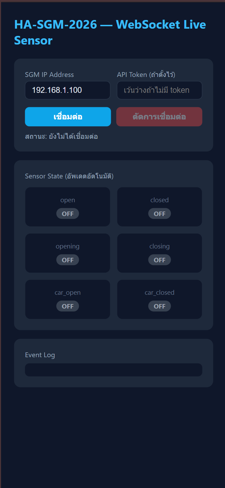

# HA-SGM-2026 — API Examples

[](https://www.espressif.com/)
[](https://www.home-assistant.io/)
[]()
[]()

ตัวอย่างการใช้งาน **REST API · WebSocket · Webhook · UART** สำหรับ **HA-SGM-2026 Smart Gate Module**  
ระบบควบคุมประตูอัตโนมัติ ESP32 — เชื่อมต่อ Home Assistant ผ่าน MQTT พร้อม API ครบรูปแบบ

> **Copyright © 2026 Wanchai DIY. All rights reserved.**  
> ห้ามคัดลอก ดัดแปลง หรือนำไปใช้เชิงพาณิชย์โดยไม่ได้รับอนุญาต

---

## ไฟล์ในโปรเจกต์นี้

| ไฟล์ | ประเภท | คำอธิบาย |
|------|--------|---------|
| [`examples/webapp_smartgate.html`](examples/webapp_smartgate.html) | Web App | หน้าควบคุมประตู (light theme) — เชื่อมตรง ESP32 |
| [`examples/liff_smartgate.html`](examples/liff_smartgate.html) | LINE LIFF | หน้าควบคุมประตูบน LINE — login ด้วย LINE account |
| [`examples/ws_client.html`](examples/ws_client.html) | WebSocket | Browser client — ดูสถานะ sensor แบบ real-time |
| [`examples/webhook_receiver.py`](examples/webhook_receiver.py) | Webhook | Python server รับ POST จาก SGM |
| [`examples/api_examples.sh`](examples/api_examples.sh) | REST API | curl commands ครบทุก endpoint |
| [`examples/uart_client.py`](examples/uart_client.py) | UART | Python client คุยกับ SGM ผ่าน Serial |
| [`examples/uart_arduino/uart_arduino.ino`](examples/uart_arduino/uart_arduino.ino) | UART | Arduino client สำหรับต่อกันเป็น hardware |
| [`examples/webhook_line.example.php`](examples/webhook_line.example.php) | Webhook + LINE | รับ webhook แล้วส่ง LINE Notify |

---

## ภาพรวมระบบ

```
http://smartgate-xxxx.local/     ← REST API  (port 80)  — LAN
http://192.168.x.x/              ← REST API  (port 80)  — LAN
ws://192.168.x.x:81/             ← WebSocket (port 81)
UART0 (GPIO1/3) 115200           ← Serial device protocol
```

> `xxxx` คือ 4 หลัก hex จาก MAC address ของแต่ละตัว เช่น `smartgate-a1b2`

---

## REST API

### สรุป Endpoints

| Method | Endpoint | Auth | LAN Only | คำอธิบาย |
|--------|----------|------|----------|---------|
| `GET`  | `/`              | —                    | ✅ | Device info (ไม่ต้อง token) |
| `GET`  | `/api/info`      | TOKEN (header/query) | ❌ | Device info |
| `GET`  | `/api/sensor`    | TOKEN (header/query) | ❌ | สถานะ sensor ทั้งหมด |
| `POST` | `/api/press`     | TOKEN (header)       | ❌ | สั่งกดปุ่ม |
| `GET`  | `/token`         | `?secret=`           | ✅ | ดึง token จาก secret |
| `POST` | `/token`         | TOKEN (header) + secret | ✅ | เปลี่ยน secret และ token |
| `POST` | `/reset`         | TOKEN (header)       | ✅ | Factory reset |

> **LAN Only** — เข้าได้เฉพาะ `http://192.168.x.x` หรือ `http://smartgate-xxxx.local` เท่านั้น  
> การเข้าผ่าน proxy / tunnel / โดเมนภายนอกจะได้รับ `403`

---

### Token Authentication

Token สร้างจาก `SHA256(secret + MAC address)` ใส่ได้ 2 วิธี:

```bash
# วิธีที่ 1 — Query parameter
GET /api/sensor?token=<TOKEN>

# วิธีที่ 2 — HTTP Header
GET /api/info
TOKEN: <TOKEN>
```

---

### ตัวอย่างการใช้งาน

```bash
IP="192.168.1.80"
TOKEN="your_token_here"

# ── Device Info ──────────────────────────────────────────
# จาก LAN (ไม่ต้อง token)
curl "http://$IP/"

# จากภายนอก (ต้องใช้ token)
curl "http://$IP/api/info?token=$TOKEN"
curl "http://$IP/api/info" -H "TOKEN: $TOKEN"

# ── Sensor ───────────────────────────────────────────────
curl "http://$IP/api/sensor?token=$TOKEN"
curl "http://$IP/api/sensor" -H "TOKEN: $TOKEN"

# ── กดปุ่ม ───────────────────────────────────────────────
curl -X POST "http://$IP/api/press?button=open"  -H "TOKEN: $TOKEN"
curl -X POST "http://$IP/api/press?button=closed" -H "TOKEN: $TOKEN"
curl -X POST "http://$IP/api/press?button=stop"  -H "TOKEN: $TOKEN"

# car button
curl -X POST "http://$IP/api/press?car=add"    -H "TOKEN: $TOKEN"
curl -X POST "http://$IP/api/press?car=remove" -H "TOKEN: $TOKEN"

# ── Token ─────────────────────────────────────────────────
# ดึง token (LAN only)
curl "http://$IP/token?secret=your_secret"

# เปลี่ยน secret และ token ใหม่ (LAN only)
curl -X POST "http://$IP/token" \
     -H "TOKEN: $TOKEN" \
     -d "secret=new_secret"
```

---

### Response: `/api/sensor`

```json
{
  "open":       false,
  "closed":     true,
  "opening":    false,
  "closing":    false,
  "car_open":   false,
  "car_closed": false
}
```

### Response: `/api/info`

```json
{
  "device":         "smartgate-a1b2",
  "ip":             "192.168.1.80",
  "ssid":           "MyWiFi",
  "rssi":           -55,
  "mac":            "AA:BB:CC:DD:EE:FF",
  "mqtt_host":      "192.168.1.10",
  "mqtt_port":      1883,
  "mqtt_user":      "user",
  "mqtt_connected": true,
  "webhook_url":    "https://example.com/webhook",
  "uptime_s":       3600,
  "fw_version":     "ha-sgm-2026-acdc-2.2-esp32-1.0.0"
}
```

### Response: `/token` (POST)

```json
{
  "ok":    true,
  "token": "new_token_value..."
}
```

---

### Token Brute-Force Protection

`GET /token` มีระบบป้องกัน brute-force — กรอก secret ผิดเกิน **5 ครั้ง** จะล็อกทันทีจนกว่าจะ reboot ESP32

```json
// ผิด ครั้งที่ 1–4
{ "error": "invalid secret", "remaining": 3 }

// ผิด ครั้งที่ 5 (ล็อก)
{ "error": "locked — reboot required" }
```

---

## 2 · Web App (Standalone)

**ไฟล์:** [`examples/webapp_smartgate.html`](examples/webapp_smartgate.html)

หน้าควบคุมประตู **light theme** — เปิดในเบราว์เซอร์โดยตรง ไม่ต้องติดตั้ง server  
เชื่อมต่อตรงกับ ESP32 ผ่าน WebSocket หรือ REST API polling

**แก้ไข CONFIG ในไฟล์:**

```js
const CONFIG = {
  API_URL:     "http://192.168.1.80",   // IP ของ ESP32
  WS_URL:      "ws://192.168.1.80:81",  // WebSocket ESP32
  TOKEN:       "YOUR_TOKEN_HERE",        // token จาก GET /token
  STORAGE_KEY: "sgm_auth",
};
```

**ฟีเจอร์:**
- ปุ่มเปิด / ปิด / หยุดประตู
- แสดงสถานะ sensor แบบ real-time ผ่าน WebSocket
- login ด้วยรหัสผ่าน `YYYYMMDDHH` (เปลี่ยนทุกชั่วโมง)
- รองรับทั้ง desktop และมือถือ

---

## 3 · LINE LIFF App

**ไฟล์:** [`examples/liff_smartgate.html`](examples/liff_smartgate.html)

หน้าควบคุมประตู **dark theme** สำหรับเปิดใน **LINE** ผ่าน LIFF  
login ด้วย LINE account + รหัสผ่าน แสดงชื่อและรูปโปรไฟล์ LINE

**แก้ไข CONFIG ในไฟล์:**

```js
const CONFIG = {
  LIFF_ID: "YOUR_LIFF_ID",                    // จาก LINE Developers Console
  API_URL: "https://your-server.example.com", // URL ของ backend server
  WS_URL:  "wss://your-server.example.com/ws",// WebSocket (wss:// สำหรับ https)
  TOKEN:   "YOUR_TOKEN_HERE",                 // token จาก GET /token
};
```

**ขั้นตอนการตั้งค่า:**

1. สร้าง LIFF app ที่ [LINE Developers Console](https://developers.line.biz/)
2. ตั้ง LIFF URL ให้ชี้ไปที่ไฟล์นี้บน server
3. แก้ไข CONFIG ในไฟล์
4. เพิ่ม LIFF ใน LINE OA

**ความแตกต่างจาก webapp:**

| | webapp | liff |
|--|--|--|
| Login | รหัสผ่าน YYYYMMDDHH | LINE account + รหัสผ่าน |
| Theme | Light | Dark |
| เชื่อมต่อ | ตรง ESP32 | ผ่าน server/ngrok |
| ปุ่ม | เปิด/ปิด/หยุด | เปิดอย่างเดียว |
| Platform | Browser ทั่วไป | LINE app |

---

## 4 · WebSocket (Raw Client)

```
URL: ws://<IP>:81/
URL (มี token): ws://<IP>:81/?token=<TOKEN>
```

ESP32 push JSON ทุกครั้งที่ sensor เปลี่ยนสถานะ:

```json
{
  "open":       false,
  "closed":     true,
  "opening":    false,
  "closing":    false,
  "car_open":   false,
  "car_closed": false
}
```

ทดสอบด้วย terminal:

```bash
npm install -g wscat
wscat -c "ws://192.168.1.80:81/?token=your_token"
```

**ไฟล์:** [`examples/ws_client.html`](examples/ws_client.html) — เปิดในเบราว์เซอร์โดยตรง



---

## 5 · Webhook

SGM ส่ง HTTP POST ทุกครั้งที่ sensor เปลี่ยนสถานะ

**Payload:**

```json
{
  "device": "smartgate-a1b2",
  "sensor": "open",
  "state":  "ON",
  "ip":     "192.168.1.80"
}
```

| ค่า `sensor` | ความหมาย |
|-------------|---------|
| `open`       | ประตูเปิดแล้ว |
| `closed`     | ประตูปิดสนิท |
| `opening`    | กำลังเปิด |
| `closing`    | กำลังปิด |
| `car_open`   | รถผ่านฝั่งเปิด |
| `car_closed` | รถผ่านฝั่งปิด |

**ตั้งค่า:** WiFiManager Config Portal → กรอก Webhook URL และ Secret

**Python receiver:** [`examples/webhook_receiver.py`](examples/webhook_receiver.py)

```bash
pip install flask
WEBHOOK_TOKEN=your_token python examples/webhook_receiver.py
```

**LINE Notify:** [`examples/webhook_line.example.php`](examples/webhook_line.example.php)

---

## 6 · UART Serial

ควบคุมผ่าน Serial โดยตรง ไม่ต้องใช้ WiFi  
**UART0 · GPIO1=TX / GPIO3=RX · 115200 baud**

### คำสั่ง

| คำสั่ง | ผลลัพธ์ |
|--------|--------|
| `open\n`           | เปิดประตู → `OK:open` |
| `close\n`          | ปิดประตู  → `OK:close` |
| `stop\n`           | หยุด      → `OK:stop` |
| `carlink_add\n`    | Carlink เพิ่ม → `OK:carlink_add` |
| `carlink_remove\n` | Carlink ลบ   → `OK:carlink_remove` |
| `sensor\n`         | อ่านสถานะ → JSON |

### ข้อมูลที่รับจาก SGM

```
READY ip=192.168.1.80
{"open":false,"closed":true,...,"status":"closed"}
OK:open
ERR:unknown:xyz
```

### Python Client

```bash
pip install pyserial
python examples/uart_client.py
python examples/uart_client.py --port COM3
python examples/uart_client.py --port COM3 --listen
```

### Arduino Client — การต่อสาย

```
SGM (TX GPIO1) ──► Arduino RX1
SGM (RX GPIO3) ◄── Arduino TX1
SGM GND        ─── Arduino GND
```

---

## WiFiManager Config Portal

เมื่อ ESP32 ยังไม่ได้ตั้งค่า WiFi จะเปิด Hotspot:

```
Hotspot-SmartGate-xxxx   (xxxx = 4 หลัก hex จาก MAC)
```

เชื่อมต่อแล้วเปิด browser ไปที่ `http://8.8.8.8`

| ฟิลด์ | คำอธิบาย |
|-------|---------|
| Friendly Name | ชื่ออุปกรณ์ (default: `smartgate-xxxx`) |
| MQTT Broker IP | IP ของ MQTT broker |
| MQTT User / Password | credentials |
| Webhook URL | URL สำหรับรับ webhook |
| API & Webhook Secret | secret สำหรับสร้าง token |

---

## Related

- [HomeAssistant Gate Control Card]((https://github.com/vanchaiy/HA-Gate-Control-Card))
- [Home Assistant](https://www.home-assistant.io/)
- [LINE Messaging API](https://developers.line.biz/en/docs/messaging-api/)

---

*HA-SGM-2026 · ESP32 Smart Gate · WebSocket · Webhook · UART · Home Assistant · MQTT · LINE Notify · IoT · ประตูอัตโนมัติ · Wanchai DIY*
